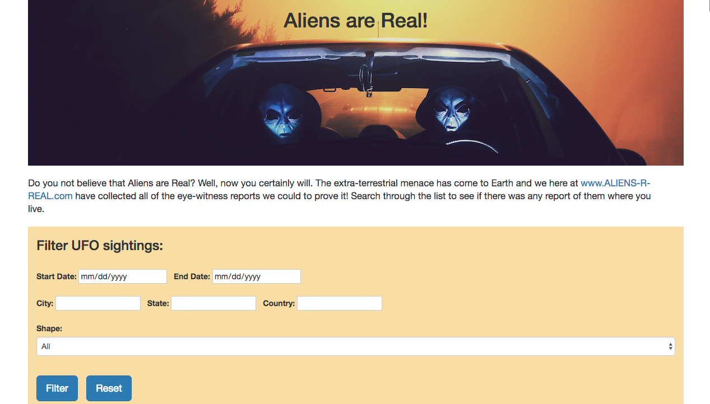
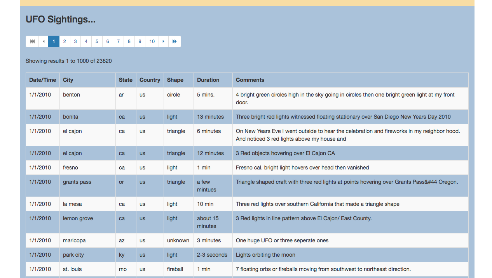

# Aliens-R-Real
The extra-terrestrial menace has come to Earth and we here at **www.ALIENS-R-REAL.com** have collected all of the eye-witness reports we could to prove it! All we need to do now is put this information online for the world to see and then the matter will finally be put to rest.

There is just one tiny problem though... Our collection is too large to search through manually. Even our most dedicated followers are complaining that they are having trouble locating specific reports in this mess.

We need to write code that will create a table dynamically based upon a [dataset we provide](Data/data.js). We also need to allow our users to search through the table for specific pieces of information.

## Technologies used
This project uses only HTML, CSS and Javascript with D3.js to implement a page with a data table and filter fields to filter the table contents. It also has pagination features to show multiple pages of results using only client side technology.

## Sample Page

Take a look at the 
[resulting html page](index.html)

